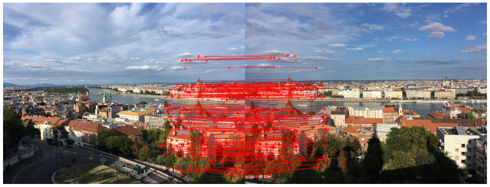
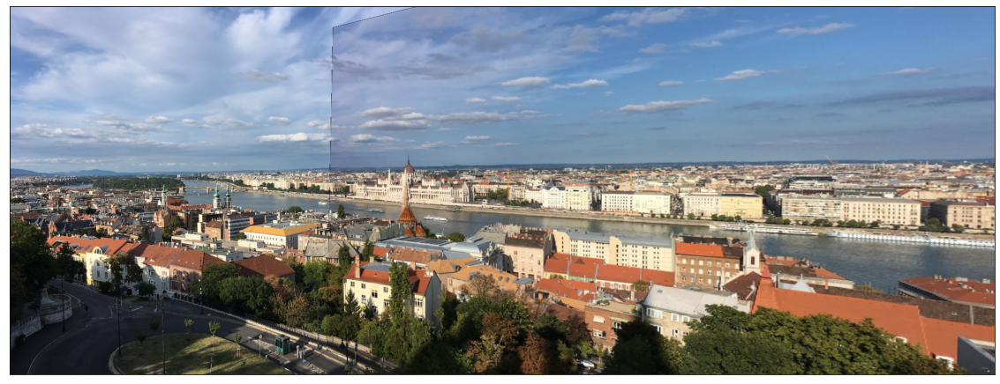
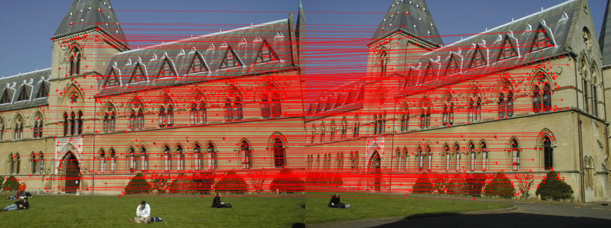
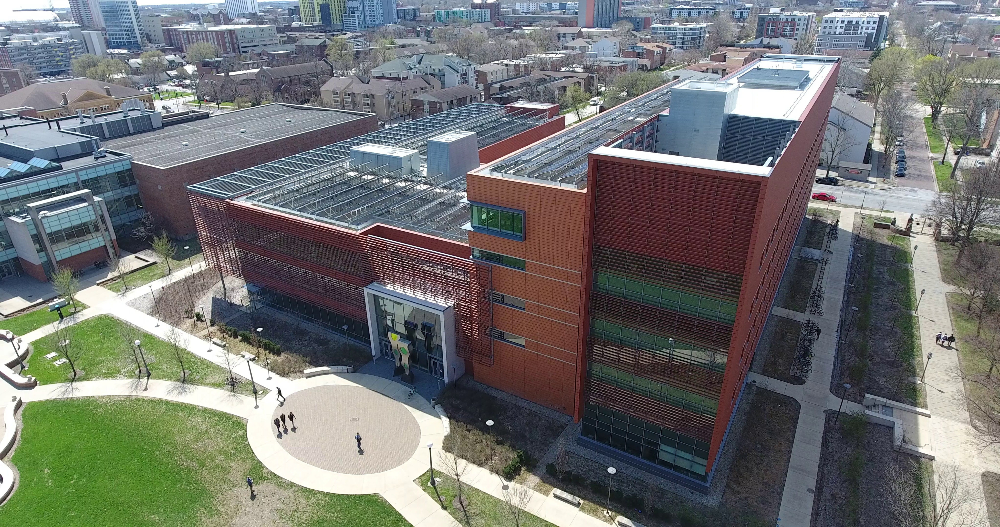

## ECE549 / CS543 Computer Vision, Spring 2021, Assignment 3

### Instructions

1.  Assignment is due at **11:59:59 PM on Monday April 05 2021**.

2.  See [policies](http://saurabhg.web.illinois.edu/teaching/ece549/sp2021/policies.html)
    on [class website](http://saurabhg.web.illinois.edu/teaching/ece549/sp2021/).

3.  Submission instructions:

    1.  A single `.pdf` report that contains your work for Q1, Q2 and
        Q3. PDF file should be submitted to
        [Gradescope](https://www.gradescope.com) under `MP3`. Course code is
        **3YR7GY**. Please tag the reponses in your PDF with the Gradescope
         questions outline  as described in [Submitting an Assignment](https://youtu.be/u-pK4GzpId0).  

    2.  You also need to submit code for all the questions in the form of a single
        `.zip` file that includes all your code, all in the same
        directory. You can submit Python code in either `.py` or
        `.ipynb` format. Code should also be submitted to
        [Gradescope](https://www.gradescope.com) under `MP3-Code`. 
        *Not submitting your code will lead to a loss of
        100% of the points.*

    3.  We reserve the right to take off points for not following
        submission instructions. In particular, please tag the responses in your
        PDF with the Gradescope questions outline as described in
        [Submitting an Assignment](https://youtu.be/u-pK4GzpId0)).

4.  Lastly, be careful not to work of a public fork of this repo. Make a
    private clone to work on your assignment. You are responsible for
    preventing other students from copying your work. Please also see point 2
    above.

### Problems

1.  **Stitching pairs of images [30 pts][^1].** We will estimate homography 
    transforms to register and stitch image pairs as discussed in 
    [lecture 12](http://saurabhg.web.illinois.edu/teaching/ece549/sp2021/slides/lec12_alignment.pdf).

    **Test Images:** We are providing a image pairs that you should stitch 
    together, and some starter code. See folder [stitch](Q1/stitch) and file
    [Q1/Q1_starter.ipynb](Q1/Q1_starter.ipynb).
    We have also provided sample output, though, keep in mind that your output 
    may look different from the reference output depending on implementation
    details.

    
  

    
  

    1.  Detect feature points in both images and extract descriptor of every 
        keypoint in both images. We will use SIFT descriptors from OpenCV library.
        You can refer to this [tutorial](https://docs.opencv.org/4.5.1/da/df5/tutorial_py_sift_intro.html) 
        for more details about using SIFT in OpenCV. Please use opencv version 4.5 or later.
    1.  Compute distances between every descriptor in one image and every
        descriptor in the other image. We will use
        `scipy.spatial.distance.cdist(X, Y, 'sqeuclidean')`.
    1.  **Putative Matches [5 pts].** Select putative matches based on the matrix
        of pairwise descriptor distances obtained above. You can select all pairs 
        whose descriptor distances are below a specified threshold, or select the
        top few hundred descriptor pairs with the smallest pairwise distances. In 
        your report, display the putative matches overlaid on the image pairs.
    1.  **Homography Estimation and RANSAC [20 pts].** Implement RANSAC to 
        estimate a homography mapping one image onto the other. Describe the 
        various implementation details, and report all the hyperparameters, the 
        number of inliers, and the average residual for the inliers (mean squared 
        distance between the point coordinates in one image and the transformed 
        coordinates of the matching point in the other image). Also, display the 
        locations of inlier matches in both images.
        
        **Hints:** For RANSAC, a very simple implementation is sufficient. Use 
        four matches to initialize the homography in each iteration. You should 
        output a single transformation that gets the most inliers in the course 
        of all the iterations. For the various RANSAC parameters (number of 
        iterations, inlier threshold), play around with a few reasonable values 
        and pick the ones that work best. Homography fitting calls for 
        homogeneous least squares. The solution to the homogeneous least squares 
        system $`AX = 0`$ is obtained from the SVD of `A` by the singular vector 
        corresponding to the smallest singular value. In Python, 
        `U, S, V = numpy.linalg.svd(A)` performs the singular value decomposition 
        (SVD). This function decomposes A into $`U, S, V`$ such that $`A = USV`$ 
        (and not $`USV^T`$) and `V[−1,:]` gives the right singular vector corresponding 
        to the smallest singular value.
    1.  **Image Warping [5 pts].** Warp one image onto the other using the 
        estimated transformation. Create a new image big enough to hold the 
        panorama and composite the two images into it. You can composite 
        by averaging the pixel values where the two images overlap, or by using
        the pixel values from one of the images. Your result should look similar
        to the sample output. You should create **color panoramas** by applying 
        the same compositing step to each of the color channels separately (for 
        estimating the transformation, it is sufficient to use grayscale images).
        You may find `ProjectiveTransform` and warp functions in 
        `skimage.transform` useful. Include the stitched image in your report. 
    1.  **Extra Credit [5 pts].**
        -  Extend your homography estimation to work on multiple images. 
           [Q1/extra_credits](Q1/extra_credits) contains three sequences with 
           three images each, that you could attempt to stitch together. 
           Alternatively, feel free to acquire your own images and stitch them.
        -  Experiment with registering very *difficult* image pairs or sequences, 
           For instance, try to find two views of the same location taken at different 
           times of day, different times of year, or try to 
           register images with a lot of repetition, or images separated by an 
           extreme transformation (large rotation, or scaling). To make stitching 
           work for such challenging situations, you may need to experiment with 
           alternative feature detectors or descriptors, as well as feature space
           outlier rejection techniques such as Lowe’s ratio test.
        -  Experiment with image blending techniques and 
           panorama mapping techniques (cylindrical or spherical).

1.  **Fundamental Matrix Estimation, Camera Calibration, Triangulation 
    [35 pts][^2].** The goal of this assignment is to implement fundamental matrix
    estimation to register pairs of images, as well as attempt camera 
    calibration, triangulation as discussed in lectures on
    [camera calibration](http://saurabhg.web.illinois.edu/teaching/ece549/sp2021/slides/lec14_calibration.pdf)
    and [epipolar geometry](http://saurabhg.web.illinois.edu/teaching/ece549/sp2021/slides/lec15_epipolar.pdf).

    **Test Images:** We are providing two image pairs, [library](./Q2/) and 
    [lab](./Q2/), and some starter code in 
    [Q2/Q2_starter.ipynb](Q2/Q2_starter.ipynb), that we will work with.

    

    
    

    1.  **Fundamental Matrix Estimation [10 pts][^2].** Given point matches, your task
        is to fit a fundamental matrix. You will implement and compare the 
        normalized and the unnormalized algorithms as discussed in 
        [the lecture](http://saurabhg.web.illinois.edu/teaching/ece549/sp2021/slides/lec15_epipolar.pdf). 
        For each algorithm and each image pair, report the estimated fundamental 
        matrix, the residual (mean squared distance (in pixels) between points 
        in both images and the corresponding epipolar line), and visualization 
        of epipolar lines and corresponding points. We have provided some 
        starter code.
        **Note:** For fundamental matrix estimation, don't forget to enforce the
        rank-2 constraint. This can be done by taking the SVD of $`F`$, setting the 
        smallest singular value to zero, and recomputing $`F`$. You should use the 
        least square setup that involves solving a homogeneous system.
    1.  **Camera Calibration [10 pts].** For the `lab` pair, calculate the camera 
        projection matrices by using 2D matches in both views and 3D point 
        coordinates in `lab_3d.txt`. Once you have computed your projection matrices, 
        you can evaluate them using the provided evaluation function 
        (evaluate_points). The function outputs the projected 2-D points and 
        residual error. Report the estimated 3 × 4 camera projection matrices (for
        each image), and residual error.
        **Hint:** The residual error should be < 20 and the squared distance of the
        projected 2D points from actual 2D points should be < 4. For the library 
        pair, there are no ground truth 3D points. Instead, camera projection 
        matrices are already provided in 
        `library1_camera.txt` and `library2_camera.txt`.
    1.  **Camera Centers [5 pts].** Calculate the camera centers using the 
        estimated or provided projection matrices for both pairs. Report the 3D
        locations of all the cameras in your report. **Hint:** Recall that the 
        camera center is given by the null space of the camera matrix.
    1.  **Triangulation [10 pts].** Use linear least squares to triangulate the
        3D position of each matching pair of 2D points using the two camera 
        projection matrices. As a sanity check, your triangulated 3D points for the
        lab pair should match very closely the originally provided 3D points in 
        `lab_3d.txt`. For each pair, display the two camera centers and 
        reconstructed points in 3D. Include snapshots of this visualization in your
        report. Also report the residuals between the observed 2D points and the 
        projected 3D points in the two images, for each pair. **Note:** You do not 
        need the camera centers to solve the triangulation problem. They are used 
        just for the visualization.
    1.  **Extra Credits [5 pts].** Use your putative match generation and RANSAC
        code from the last question to estimate fundamental matrices without 
        ground-truth matches. For this part, only use the normalized algorithm. 
        Report the number of inliers and the average residual for the inliers. 
        Compare the quality of the result with the one you get from ground-truth 
        matches. 

1.  **Single-View Geometry[30 pts][^1].** The goal of this assignment is to 
    implement algorithms for single-view geometry in the [lecture](http://saurabhg.web.illinois.edu/teaching/ece549/sp2021/slides/lec14_calibration.pdf). 
    
    **Test Images:** We are providing starter code [here](Q3/Q3_starter.ipynb), and an
     [image](Q3/eceb.jpg) that we will work with.

    

    
    

    1.  **Vanishing Points [5 pts].** Estimate the three major orthogonal 
        vanishing points. Assume that the vertical vanishing point is for the 
        Y-direction, the horizontal vanishing point to the left is the 
        Z-direction, and the horizontal vanishing point to the right is the 
        X-direction. Starter code provides an interface to mark out lines. Mark
        at least 3 lines in each orthogonal direction. We also provide data for 
        these lines in `Q3/data.pickle` in case you have trouble in using the 
        interface. Compute their intersection (the vanishing point) using least
        squares. In your report, plot the VPs and the lines used to estimate 
        them on the image plane (starter code has some plotting functions). 
        Also report the pixel coordinates for the vanishing point.
    1.  **Horizon [5 pts].** Estimate the horizon, using the vanishing points 
        for the horizontal lines. Plot the ground horizon line on the image, and 
        report its parameters in the form $`ax+by+c= 0`$ where parameters are
        normalized such that: $`a^2 +b^2 = 1`$.
    1.  **Camera Calibration [15 pts].** Using the fact that the vanishing 
        directions are orthogonal, solve for the focal length and optical center
        (principal point) of the camera. Show all your work, and report the values
        you find.
    1.  **Rotation Matrix [5 pts].** Compute and report the rotation matrix for
        the camera.
    1.  **Extra Credits [5 pts].** 
        - Attempt to fit lines to the image and estimate vanishing points 
          automatically either using your own code or code 
          downloaded from the web.
        - Use the estimated camera parameters and the camera rotations to compute 
          warps that show the ZX (corresponding to the top views of the ECE building
          and the quad). To do this: compute the appropriate rotation that will transform
          the world coordinates such that the axis of projection becomes the world Y axis. 
          Use this rotation to estimate a homography that will be used to compute the output
          view. Apply the homography to generate the top view and save it. Show your work 
          (how you obtain the necessary rotation matrices, and homography transforms), 
          and the generated view.

#### References

[^1]: Adapted from Lana Lazebnik.

[^2]: Adapted from Lana Lazebnik and James Hays.
